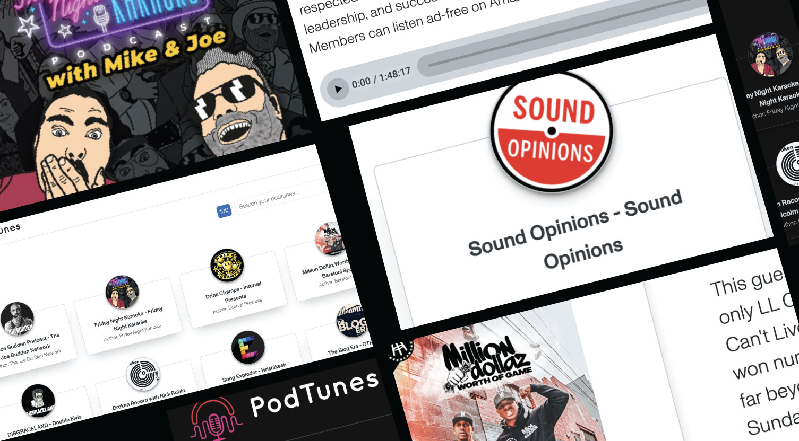

# PodTunes: Mini-Application to listening Podcasts ( React & Styled-Components )

 
 

### 🚧 **Descripción**

The mini-application for listening to podcasts created in React and styled components is a user-friendly platform that allows users to search for their favorite podcasts, view podcast details, and play podcast episodes directly from the app.

The app features a search bar that lets users search for podcasts by keywords, titles, or topics. Once the user selects a podcast, they can view its details, such as the podcast's name, description, and episode list. The app also has a built-in audio player that allows users to play, pause, and skip podcast episodes. Overall, this mini-application provides a convenient and intuitive way for users to access and listen to podcasts.
 
 

# Tech-stack used on this app.

The app was built using the latest version of:

<ol>
<li>HTML5 provides new features and improvements for building modern web applications.</li>
<li>TypeScript helps improve code quality and maintainability.</li>
<li>React, a popular JavaScript library for building user interfaces. </li>
<li>Functional components and Hooks were utilized to make the app more modular and easier to maintain.</li>
<li>React Router was used to implement client-side routing, allowing users to navigate between different pages of the app.</li>
<li>Styled-Components were used for styling, providing a convenient way to style React components with CSS.</li>
<li> Vite and Babel were used to optimize and transpile the app's code.</li>
<li>CSS 3 animations were used to create engaging visual effects.</li>
<li>Git and GitHub were used for version control and collaboration among team members.</li>
<li>Finally, unit testing was used to ensure the quality and functionality of the app.</li>
</ol>
  
 
 
In addition to the technologies and tools mentioned earlier, this app also features a theming option. This means that the app's visual appearance can be customized according to different themes or color schemes. The theming option was implemented using a combination of CSS variables and JavaScript logic to dynamically apply styles to the components based on the selected theme. This feature adds a level of personalization and flexibility to the app, allowing users to choose a theme that best suits their preferences or needs.
 
 

 
 

This project was bootstrapped with [Vite](https://vitejs.dev/), as a template.

- Before starting, clone the repository or download it to the local machine.

## Install dependencies

In the project directory, you can run:

`yarn install`

## Available Scripts

In the project directory, you can run:

`yarn dev`

Runs the app in the development mode.\
Open [http://localhost:3000](http://localhost:3000) to view it in the browser.

The page will reload if you make edits.\
You will also see any lint errors in the console.

`yarn test`

Launches the test runner in the interactive watch mode.\
See the section about [running tests](https://facebook.github.io/create-react-app/docs/running-tests) for more information.

`yarn build`

Builds the app for production to the `build` folder.\
It correctly bundles React in production mode and optimizes the build for the best performance.

The build is minified and the filenames include the hashes.\
Your app is ready to be deployed!

See the section about [deployment](https://facebook.github.io/create-react-app/docs/deployment) for more information.

### `yarn eject`

**Note: this is a one-way operation. Once you `eject`, you can’t go back!**

If you aren’t satisfied with the build tool and configuration choices, you can `eject` at any time. This command will remove the single build dependency from your project.

Instead, it will copy all the configuration files and the transitive dependencies (webpack, Babel, ESLint, etc) right into your project so you have full control over them. All of the commands except `eject` will still work, but they will point to the copied scripts so you can tweak them. At this point you’re on your own.

You don’t have to ever use `eject`. The curated feature set is suitable for small and middle deployments, and you shouldn’t feel obligated to use this feature. However we understand that this tool wouldn’t be useful if you couldn’t customize it when you are ready for it.
